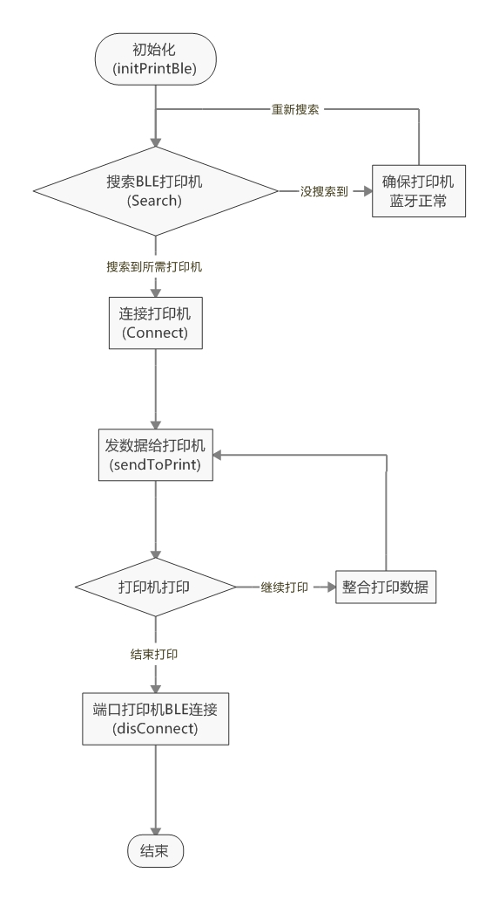
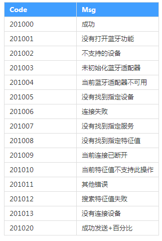

# 得实BLE蓝牙打印机插件说明

## 插件接口调用流程

## 插件接口说明
### 1、initPrintBle()
  蓝牙接口初始化，在调用插件接口时，此接口须作为首个调用的接口，否则后续调用将失败。
#### 参数
  无参数  
### 2、Search(PrintBtName,searchCallback,timeout)
搜索蓝牙打印机

#### 参数

#### PrintBtName：
数据类型：string
参数说明：打印机的蓝牙名称
传参规则：当输入""时表示搜索所有打印机；当传入蓝牙名前缀时，则搜索前缀相符的所有打印机；当传入蓝牙名全称时，只搜索指定的打印机。

#### searchCallback：
数据类型：function
参数说明：搜索完成时的回调函数
传参规则：此处传入的回调函数，应带有二个参数，搜索的结果会传递给回调函数
第一个参数表示搜索到的设备，搜索结果的数据类型为：Array.<Object>，数组中每一项的属性为：name和deviceId，分别表示：蓝牙设备的名字和蓝牙设备的ID
第二个参数表示搜索成功/失败，数据类型为：Object，属性为：Code和Msg，分别表示：结果码和结果信息

注：调用示例可参考结尾示例代码

#### timeout：
数据类型：number
参数说明：超时时间，以秒为单位
传参规则：由于蓝牙搜索比较耗费资源，建议此值切勿过大，一般3~5秒为宜

### 3、Connect(devName,devId,connectCallback)
通过设备名字与设备ID连接蓝牙打印机

#### 参数

#### devName：
数据类型：string
参数说明：打印机的蓝牙名称
传参规则：可通过接口2获取，如已知晓，也可直接传入

#### devId：
数据类型：string
参数说明：打印机蓝牙的设备ID
传参规则：可通过接口2获取，如已知晓，也可直接传入

#### connectCallback：
数据类型：function
参数说明：连接结束时的回调函数
传参规则：此处传入的回调函数，应带有一个参数，连接的结果会传递给回调函数
回调函数的数据类型：Object，属性为：Code和Msg，分别表示：连接的结果码和结果信息

注：结果码和结果信息在结果码一览中给出，调用示例可参考结尾示例代码

### 4、sendToPrint(vardata, sendCallback)
把打印数据以字节数组的形式发送给打印机进行打印

#### 参数

#### vardata：
数据类型：byteArray
参数说明：打印数据的字节数组
传参规则：所有预打印的数据，需转换为字节数组形式，可调用转换接口进行转换

#### sendCallback：
数据类型：function
参数说明：数据发送的回调函数
传参规则：此处传入的回调函数，应带有一个参数。由于BLE的限制，数据需分包发送，每次发送的结果都会通过回调函数传递给调用者。
回调函数的数据类型：Object，属性为：Code和Msg，分别表示：发送的结果码和结果信息，其中结果信息的格式为：成功发送+百分比/失败信息

注：结果码和结果信息在结果码一览中给出，调用示例可参考结尾示例代码

### 5、getBinaryArrayData(text,resultCallBack)
把一个字符串转换为字节数组的形式，作为打印数据传递给sendToPrint接口进行打印

#### 参数

#### text：
数据类型：string
参数说明：可为一个任意的字符串

#### resultCallBack：
数据类型：function
参数说明：数据转换的回调函数
传参规则：此处传入的回调函数，应带有一个参数。转换后的字节数组通过参数传出

### 6、realtimeConnectStatusChange(statusCallback)
实时监听设备的连接状态是否改变

#### 参数

#### statusCallback：
数据类型：function
参数说明：连接状态发生变化时的回调函数
传参规则：此处传入的回调函数，应带有一个参数。
回调函数的数据类型：boolean，表示:小程序与打印机蓝牙是否处于连接状态，true表示当前由断开变为连接，false表示当前由连接状态变为断开。

### 7、disConnect()
 断开与蓝牙设备的连接
#### 参数
  无参数  

注：请保证尽量成对的调用 Connect 和 disConnect 接口，否则可能会影响蓝牙设备的正常使用。

## 插件完整调用示例
```js
var plugin = requirePlugin("myPlugin")//获取插件对象的引用
var devicesList;
var connectState=false;
Page({
  onLoad: function() {
    //初始化
    plugin.initPrintBle()

    //搜索蓝牙打印机
    plugin.Search("", 
      function success(res,res2) {
        devicesList = res.slice(0);
        if (devicesList.length==0){
          if(res2.Code==201000)
            wx.showModal({
              showCancel: false,
              title: '提示',
              content: '没有搜索到，请重试',
            });
          }else{
            wx.showModal({
              showCancel: false,
              title: '提示',
              content: res2.Msg,
            });
          }
        }
      },
      4
    );

  },
  //点击“连接”按钮，开始连接
  Connect: function (e) {
    wx.showLoading({
      title: '正在连接...',
    })
    var name="DP-230-B0F0";//欲连接打印机的蓝牙名
    var printDeviceId;
    
    for (var i = 0; i < devicesList.length; i++) {
      if (name == devicesList[i].name) {
        printDeviceId = devicesList[i].deviceId;
        break;
      }
    }

    plugin.Connect(name, 
      printDeviceId,
      function rescallback(res) {
        wx.hideLoading()
       
        if(res.Code==201000){
          connectState=true;
         wx.showModal({
            showCancel: false,
            title: '提示',
            content: '连接成功，可进行打印测试！',
          });
        }else{
          wx.showModal({
            showCancel: false,
            title: '提示',
            content: '连接失败:'+res.Msg,
          });
        }
    })
  },
  //点击“打印”按钮，打印出一个字符串
  SendPrint: function () {
    var wantToPrint="厉害了，我的国";//希望打印的字符

    var strP = "^XA^LL406^FO10,10^A0,24,24^FD" + wantToPrint + "^FS^XZ";//整合为打印数据

     
     if(connectState){
       wx.showLoading({
          title: '正在发送数据...',
        })
        plugin.getBinaryArrayData(strP, function resultCallBack(resBinary){
        console.log(resBinary)
        plugin.sendToPrint(resBinary,
          function rescallback(res) {
             if(res.Code==201020){
                wx.hideLoading()
                wx.showModal({
                  showCancel: false,
                  title: '提示',
                  content: '发送已完成'
                });
            }else{
                wx.hideLoading()
                wx.showModal({
                  showCancel: false,
                  title: '提示',
                  content: res.Msg
                });
            }
          }
        )
      })
     }else{
       wx.showModal({
            showCancel: false,
            title: '提示',
            content: '连接已断开',
        });
     }
  },

})
```
## 状态码一览

